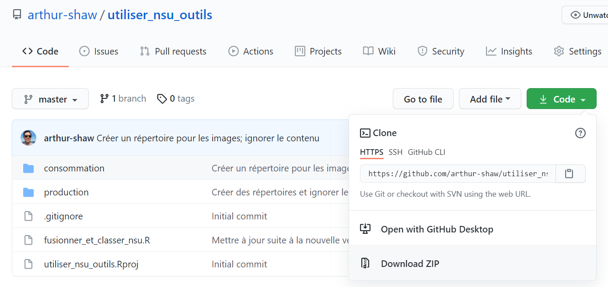
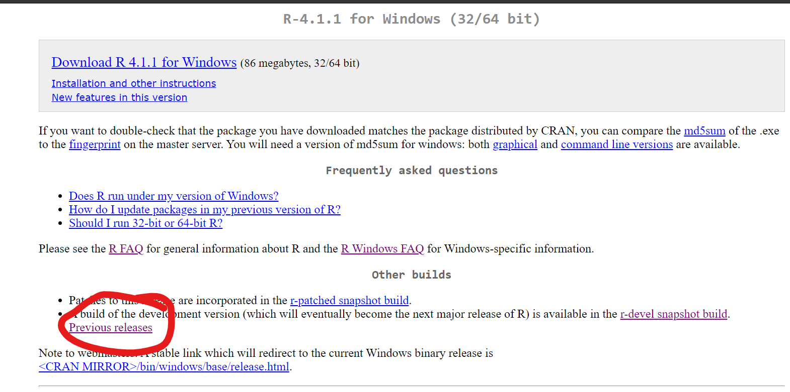

<!-- README.md is generated from README.Rmd. Please edit that file -->

# ftf\_sn\_rejet

<!-- badges: start -->
<!-- badges: end -->

## Objectifs

Ce programme de trie examine les entretiens et, en fonction d’un
ensemble de règles de contrôle-qualité, détermine comment les traiter:

-   Approuver
-   Rejeter
-   Regarder de plus près (manuellement)
-   Identifier des problèmes persistants (à voir avec le chef
    d’équipe/l’agent)

Ce programme peut ensuite exécuter, éventuellement, ces décisions en
rejetant les entretiens sur le serveur Survey Solutions et en
enregistrant sur la machine de l’utilisateur une compilation
d’entretiens nécessitant une action manuelle (e.g., examen pour décider
de rejeter, discuter avec le personnel de terrain des erreurs
persistantes, etc.)

## Installation

### Pré-requis

Avant de lancer ce programme pour la première fois, (re)installer les
logiciels suivants:

-   R
-   RTools
-   RStudio

Même si ces logiciels ont été déjà installés (e.g., lors d’une vague
antérieure d’EHCVM), il faut réinstaller afin d’avoir une version
récente d ces outils pour que le programme marche avec succès.

Veuillez lire ici-bas comment obtenir et installer ces logiciels

#### R

-   Suivre ce [lien](https://cran.r-project.org/)
-   Cliquer sur le lien approprié pour votre système d’exploitation
-   Cliquer sur `base`
-   Télécharger et installer (e.g.,
    [ceci](https://cran.r-project.org/bin/windows/base/R-4.1.1-win.exe)
    pour Windows)

#### RTools

Nécessaire pour le système d’exploitation Windows

-   Suivre ce [lien](https://cran.r-project.org/)
-   Cliquer sur `Windows`
-   Cliquer sur `RTools`
-   Télécharger et installer (e.g.,
    [ceci](https://cran.r-project.org/bin/windows/Rtools/rtools40v2-x86_64.exe)
    pour un système 64)

Ce programme permet à R de compiler des scripts C++ utilisés par
certains packages (e.g., `{dplyr}`).

#### RStudio

-   Suivre ce [lien](https://www.rstudio.com/products/rstudio/)
-   Sélectionner RStudio Desktop puis Open Source Edition
-   Cliquer sur le lien approprié pour votre système d’exploitation
-   Télécharger et installer (e.g.,
    [ceci](https://www.rstudio.com/products/rstudio/download/#download)
    pour Windows)

### Ce programme

-   Obtenir une copie du répositoire
    -   Naviguer vers [ce
        répositoire](https://github.com/arthur-shaw/ehcvm2_rejet)
    -   Cliquer sur le bouton `Code`
    -   Cliquer sur `Download ZIP`
    -   Télécharger vers le répertoire voulu sur votre machine
        
-   Décomprimer le fichier zip

## Emploi

### Fournir les paramètres du projet

Ceci comprend les étapes suivantes :

1.  Indiquer la localisation du projet
2.  Fournir les détails du serveur Survey Solutions
3.  Identifier le questionnaire dans Headquarters
4.  Fournir le `questionnaire variable` du questionnire dans Designer
5.  Spécifier comment le programme doit se comporter

#### Indiquer la localisation du projet

Pour que le programme s’exécute, il doit savoir où il se trouve dans
votre système de fichiers. Pour orienter le programme, indiquez le
chemin du fichier à la racine du projet (c’est-à-dire le répertoire dans
lequel se trouve `ftf_sn_rejet.Rproj`). Ce chemin doit être spécifié
comme la valeur de `proj_dir` (c’est-à-dire entre guillemets)

Ce faisant, suivez les règles répétées dans le morceau de code
ci-dessous :

``` r
# =============================================================================
# Localisation de la racine du projet
# =============================================================================

# suivre ces consignes dans la spécification du répertoire racine
# - utiliser / au lieu de \ dans le chemin
# - être certain de mettre / à la fin du che
proj_dir    <- ""
```

#### Fournir les détails du serveur Survey Solutions

Pour que le programme interagisse avec votre serveur de quelque manière
que ce soit, que ce soit en téléchargeant des données ou en rejetant des
interviews, il a besoin de détails de connexion.

Ces détails sont les suivants :

-   `server`. URL complète du serveur.
-   `workspace`. Nom de l’espace de travail–pas le nom d’affichage.
-   `user`. Nom d’utilisateur pour un administrateur ou d’un utilisateur
    API autorisé pour l’espace de travail ci-haut.
-   `password`. Mot de passe pour cet utilisateur.

``` r
# =============================================================================
# Fournir les détails du serveur Survey Solutions
# =============================================================================

# fournir
server      <- ""
workspace   <- ""
user        <- ""
password    <- ""

susoapi::set_credentials(
    server = server,
    user = user,
    password = password
)
```

Pour plus d’informations sur la raison pour laquelle ces informations
sont nécessaires et comment elles sont utilisées, veuillez lire sur
l’authentification Survey Solutions
[ici](https://arthur-shaw.github.io/susoapi/articles/authentication.html)

#### Identifier le questionnaire dans Headquarters

``` r
# =============================================================================
# Questionnaire sur Headquarters dont les données sont à passer en revue
# =============================================================================

# fournir un texte qui identifie le questionanire. il peut s'agir du:
# - nom complet
# - sous-texte
# - expression régulière
qnr_expr <- ""
```

#### Fournir le `questionnaire variable` du questionnire dans Designer

``` r
# =============================================================================
# Questionnaire sur Designer
# =============================================================================

# fournir la "variable du questionnaire".
# normalement, ça doit être "menage", comme la valeur de défaut ici-bas
# pour certains, ça a été modifié, parfois pour des raisons d'organisation interne
# pour vérifier ou modifier, voici comment faire:
# - se connecter à Designer
# - ouvrir le questionnaire ménage
# - cliquer sur paramètres
# - copier ce qui figure dans le champs "questionnaire variable" et le coller ici-bas
# pour des informations complémentaires, voir ici: https://docs.mysurvey.solutions/questionnaire-designer/components/questionnaire-variable/
main_file_name <- ""
main_file_dta <- paste0(main_file_name, ".dta")
```

#### Spécifier comment le programme doit se comporter

Le programme doit savoir comment agir en trois dimensions :

1.  Quels statuts d’entretien Survey Solutions prendre en compte pour
    examen
2.  Quels problèmes doivent donner lieu à un rejet
3.  Si le programme doit rejeter les entretiens dont le rejet est
    recommandé

La variable `statuses_to_reject` capture la liste séparée par des
virgules des statuts soumis au contrôle. Voir les notes ci-dessous sur
les statuts d’entretien actuellement autorisés.

La variable `issues_to_reject` capture la liste séparée par des virgules
des problèmes qui enclenchent le rejet. Voir les notes ci-dessous
concernant les types de problèmes.

La variable `should_reject` indique si les entretiens recommandés pour
rejet doivent ou non être automatiquement rejetés. Voir le morceau de
code ci-dessous sur la façon dont les valeurs sont interprétées.

``` r
# =============================================================================
# Comportement du rejet: quels statuts et quels problèmes rejeter
# =============================================================================

# Fournir une liste délimitée par virgule des statuts d'entretien à passer en revue
# Voir les valeurs ici: https://docs.mysurvey.solutions/headquarters/export/system-generated-export-file-anatomy/#coding_status
# Statuts admis par ce script: 
# - Completed: 100
# - ApprovedBySupervisor: 120
# - ApprovedByHeadquarters: 130
statuses_to_reject <- c(100, 120)

# Fournir une liste délimitée par virgule des types de problèmes à rejeter
# {susoreview} utilise les codes suivants:
# - 1 = Rejeter
# - 2 = Commenter une variable
# - 3 = Erreur de validation de Survey Solutions
# - 4 = Passer en revue
issues_to_reject <- c(1)

# Rejeter les entretiens automatiquement
# - Si TRUE, le programme demande au serveur de rejeter ces entretiens.
# - Si FALSE, le programme ne rejette pas.
# - Dans les deux cas, les entretiens à rejeter, ainsi que les motifs de rejet,
#   sont sauvegardés dans `/output/`
should_reject <- FALSE
```

### Lancer

Une fois les préparatifs ci-haut terminés, il est temps de lancer le
programme. Pour ce faire:

-   Ouvrir RStudio
-   Ouvrir le fichier `ftf_sn_rejet.Rproj` qui aura l’effet de fournir
    les ressources du projet
-   Ouvrir le fichier `_run.R` que vous avez modifié plus haut
-   Lancer le programme
-   Accepter de mettre à jour les packages

Après avoir ouvert le fichier `ftf_sn_rejet.Rproj`, RStudio affichera un
message comme suit, indiquant que:


-   Le package `{renv}`, qui est reponsable contrôles la version des
    packages chez tous les utilisateurs, a été installé
-   La version de R installée sur votre machine soit est soit n’est pas
    en en phase avec la version indiqué dans le fichier de contrôle de
    version.

Si votre version de R n’est pas en accord avec la version de R attendu,
veuillez installer la version convenue. S’il s’agit d’une plus ancienne
version de R, il faut aller la chercher sur CRAN:

-   Suivre les instructions [ici](#r)
-   Suivre le lien montré ici-bas 
-   Chercher, obtenir, et installer la version convenue (e.g., 4.0.4)
    

Lors du premier lancement du, RStudio demandera si vous voulez adopter
les packages demandé pour ce projet, comme indiqué ici-bas.


Taper `y` dans la console de RStudio. Ceci créera un répertoire pour ce
projet dont les versions des packages s’accorderont avec ce qui est jugé
nécessaire pour le bon déroulement du programme. Ceci n’aura pas d’effet
sur les versions des packages installées sur votre machine. Pour en
savoir plus, regarder la documentation de `{renv}`
[ici](https://rstudio.github.io/renv/articles/renv.html).

### Dépanner

#### Problèmes connus

Si vous lancez le programme comme indiqué ci-haut et rencontrez une
erreur qui ressemble celle ici-bas, R rencontre un problème à
télécharger et installer les packages requis.


Pour surmonter ce problème, veuillez suivre ces étapes:

-   Ouvrir le fichier Rproj
-   Avant de lancer le programme, exécuter la commande:
    `Sys.setenv(RENV_DOWNLOAD_METHOD = "wininet")`
-   Lancer le programmer

Si le lancement du programme échoue à nouveau, il est fort à parier que
R–ou plutôt le package `{renv}`–rencontre problèmes à télécharger et
installer le package `{nsuoutils}` depuis GitHub.

Pour aider R à installer `{nsuoutils}`, veuillez suivre ces étapes:

-   Ouvrir une nouvelle instance de RStudio. C’est à dire:
    -   Fermer toute fenêtre de RStudio déjà ouvert
    -   Ouvrir RStudio à nouveau
    -   S’assurer que le projet `utiliser_nsu_outils` est bien fermé. Au
        besoin, le fermer comme montré ici-bas:


-   Installer les packages manquants en exécutant les commandes
    suivantes:

``` r
# d'abord installer {nsuoutils}
install.packages("devtools")
devtools::install_github("arthur-shaw/nsuoutils")
 
# ensuite, installer {rmarkdown} 
# au cas où il n'est pas installé lors de l'installation de {nsuoutils}
install.packages("rmarkdown")
```

-   Relancer le programme le programme comme indiqué [ici](#lancer)

#### Problèmes inconnus

Si vous disposer d’un compte GitHub, créer un issue
[ici](https://github.com/arthur-shaw/nsuoutils), chez le package
responsable des manipulations faites dans ce programme.

Si vous n’avez pas de compte, envoyer un message.

Dans les deux cas, tâcher de fournir un descriptif détaillé et, si
possible, un exemple reproduisible. Dans le descriptif détaillé,
envoyer:

-   Description des étapes suivies
-   Capture d’écran du message d’erreur
-   Informations concernant votre séance de travail, lancer des
    commandes après l’échec du programme et copier-coller le résultat:

``` r
# ceci fournit des informations détaillées sur les actions prises par {renv}
# dans l'installation de packages requis, et met en évidence
# les problèmes rencontrés et les paramètres utilisé 
renv::diagnostics()

# ces commandes fournissent des informations sur:
# - la méthode employée pour télécharger les packages
# - le répositore où les packages sont recherchés
getOption("download.file.method")
capabilities("libcurl")
getOption("repos")

# cette commande fournit des informations sur votre environnement d'exécution
sessionInfo()
```

Dans l’exemple reproduisible, partager les données d’entrée par un moyen
sécurisé (i.e., pas GitHub, rien de publique où d’autres peuvent voir
les données).
